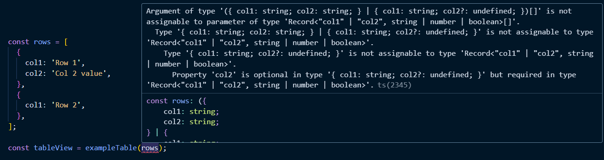
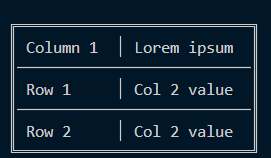

Here's the **README.md** in English:

# TableJS

**TableJS** is a simple and lightweight library for generating tables from provided data. It allows you to easily define columns and build tables with custom rows.

## Installation

You can install TableJS using npm:

```bash
npm install tablejs
```

or with yarn:

```bash
yarn add tablejs
```

## Usage

### Define Table Structure

To create a table, you first need to define the columns by passing an object with column names and the number of columns to display into the `table` function.

Example:

```javascript
import { table } from "tablejs";

export const exampleTable = table(
  {
    col1: "Column 1",
    col2: "Lorem ipsum",
  },
  4 // Number of columns to display
);
```

### Adding Rows to the Table

To populate a table with data, pass an array of strings to a previously defined table function. Each string must correspond to the keys of certain columns. If any column is not filled and you use TypeScript, it will throw an error and throw a type error.



Example:

```javascript
const rows = [
  {
    col1: "Row 1",
    col2: "Col 2 value",
  },
  {
    col1: "Row 2",
    col2: "Col 2 value",
  },
];

const tableView = exampleTable(rows);
```

### Full Example

```javascript
import { table } from "tablejs";

// Define a table with two columns
export const exampleTable = table(
  {
    col1: "Column 1",
    col2: "Lorem ipsum",
  },
  4 // Number of columns
);

// Array of rows to populate the table
const rows = [
  {
    col1: "Row 1",
    col2: "Col 2 value",
  },
  {
    col1: "Row 2",
    col2: "Col 2 value",
  },
];

// Generate the table from the provided rows
const tableView = exampleTable(rows);

// tableView now contains the table structure with the given data
```

### Result



### Arguments

- **`columns`** (object): Defines the structure of the table where the keys are the column identifiers and the values are the column headers.
- **`displayColumnCount`** (number): Specifies the number of columns to display in the table.

## Support

If you have any questions or issues, feel free to open an issue in the repository or reach out to the author on GitHub.

## License

This project is licensed under the MIT License.
